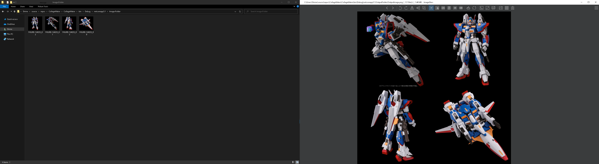
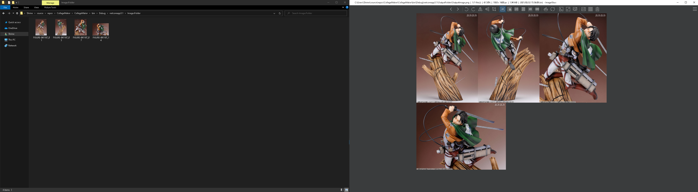
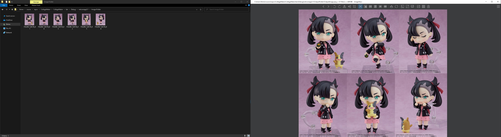

# CollageMaker
I created this to quickly staple multiple images into one single image so they could be shared online more easily. Uses the ImageSharp nuget package. 

Examples (input on the left, output on the right):

Usage: 

Place images to be stapled together in the ImagesFolder. Run CollageMaker.exe. Final image will be inside the OutputFolder.
